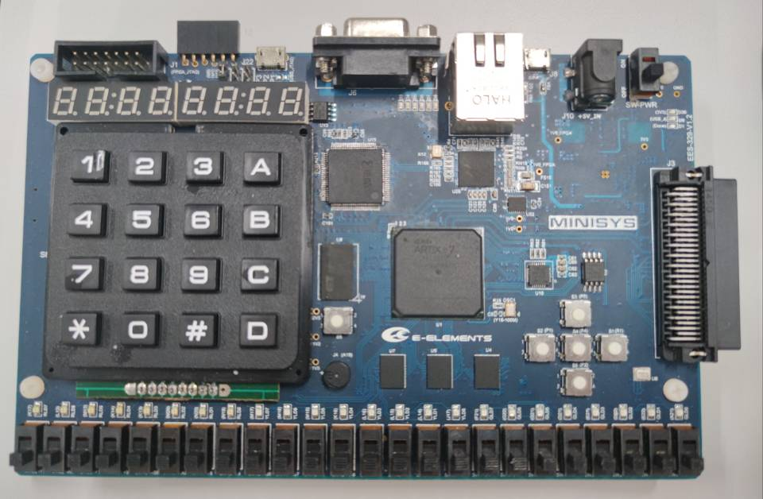
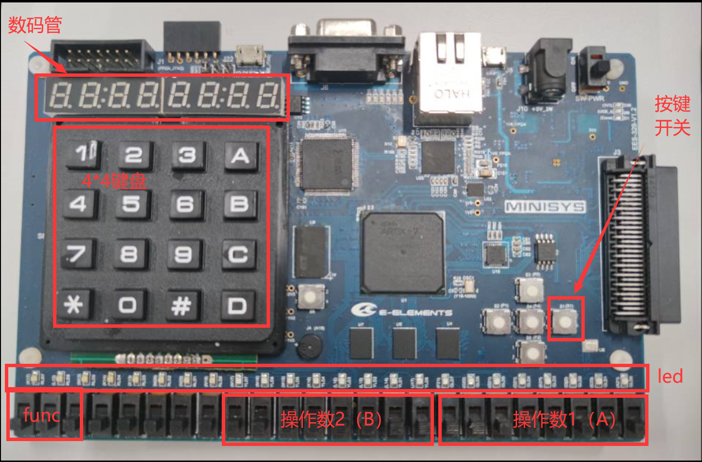

<div id="top"></div>

<br />
<div align="center">
  <h1 align="center">miniRV-1 on FPGA</h1>
  <p align="center">
    动手设计自己的cpu
  </p>
</div>


<details>
  <summary>Table of Contents</summary>
  <ol>
    <li>
      <a href="#about-the-project">About The Project</a>
      <ul>
        <li><a href="#pre-knowledge">Pre-Knowledge</a></li>
        <li><a href="#tool">Tool</a></li>
      </ul>
    </li>
    <li><a href="#feature">Feature</a>
    <li>
      <a href="#function">Function</a>
      <ul>
        <li><a href="#basic">Basic</a></li>
        <li><a href="#more">More</a></li>
      </ul>
    </li>
    <li><a href="#project-structure">Project Structure</a>
    <li><a href="#about-design">About Design</a>
      <ul>
        <li><a href="#how-to-enhance">Howt to Enhance</a></li>
      </ul>
    </li>
    <li><a href="#important-tips">Important Tips</a></li>
    <li><a href="#contribute">Contributing</a>
      <ul>
      <li><a href="#how-to-contribute">How to Contribute</a></li>
      </ul>
    </li>
    <li><a href="#license">License</a></li>
    <li><a href="#acknowledgements">Acknowledgments</a></li>
  </ol>
</details>


## About The Project

本项目来源于HITSZ_22年夏季学期，计算机设计与实践课程。该课程需要从零开始设计和实现支持miniRV-1的单周期和流水线CPU，并设计相应的外设。

###  
* lab_1：编写特定功能的汇编
* lab_2：单周期cpu
* lab_3：流水线cpu

### Pre-Knowledge

* 数字逻辑
* verilog编程基础
* 计算机组成原理

### Tool

* vivado 2018.3
* vscode (optional)
* ubuntu (for trace)
* FPGA xc7a100tfgg484-1 

  <details>
    <summary>
      What does it look like?
    </summary>
    
    

    </img>
  </details>


<p align="right">(<a href="#top">back to top</a>)</p>

## Feature

1. 实现了miniRV-1的全部指令，共**37**条。（miniRV-1为RV32I的子集）

|类型|指令|
|-|-|
|R |add, sub, and, or, xor, sll, srl, sra, slt, sltu |
|I |addi, andi, ori, xori, slli, srli, srai, slti, sltiu, lb, lbu, lh, lhu, lw, jalr |
|S |sb, sh, sw |
|B |beq, bne, blt, bltu, bge, bgeu |
|U |lui, auipc |
|J|jal |

2. CPU主频125MHZ，不是本项目流水线CPU的上限（但只是测试了实验1的程序）

3. 流水线采用最简单的预测，预测总是跳转

<p align="right">(<a href="#top">back to top</a>)</p>

## Function

### Basic
* 使用拨码开关进行输入，将计算结果显示在led和数码管中。（了解更多，见指导书）

```verilog

  input opNum1[7:0] // A(signed)
  input opNum2[7:0] // B(signed)
  input func[2:0]   // +, -, *, >>(signed), <<, |, &

  // led灯
  output led[23:0]    
  // 数码管
  output digit_tube_en[7:0] //使能信号
  output led_ca
  output led_cb
  output led_cc
  output led_cd
  output led_ce
  output led_cf
  output led_cg
  output led_dp
```
### More

* 由于所有的miniRv-1指令都已经实现（可以支持更多的操作），所以如果你有兴趣，那么可以将更多的外设接入到PFGA中

|已经实现的|可以但待实现的|
|-|-|
|拨码开关，数码管，led灯，按键开关|4 * 4 键盘，usb，显示屏，流水灯...|

<p align="right">(<a href="#top">back to top</a>)</p>

## Project Structure

* 说明
  1.  本项目采用的是外设和内存统一编址
  2.  本项目采用经典5级流水线设计
  3.  top.v用于trace验证，top_computer.v用于生成bit stream（即，下板）
  4.  以下给出的是流水线的结构，单周期结构类似

```
top.v / top_computer.v   // 整机
├── bus.v                       // 数据总线                 
│   ├── DigitDriver.v           // 数码管 IO接口
│   ├── DRAM.v                  // 数据存储器
│   ├── LedDriver.v             // led IO接口
│   └── SwitchDriver.v          // 拨码开关 IO接口
├── IROM.v                      // 指令存储器
├── mini_RV.v                   // cpu
│   ├── PC.v                    // pc, npc单元
│   ├── RF.v                    // 寄存器堆
│   ├── SEXT.v                  // 立即数扩展单元
│   ├── ALU.v                   // 计算单元
│   ├── BRANCH.v                // 分支比较单元
│   ├── CONTROLLER.v            // 控制器
│   ├── CONTROL_HZ.v            // 控制冒险处理单元
│   ├── DATA_HZ.v               // 数据冒险数理单元
│   ├── S_L_HZ.v                // store load 冒险处理单元（但不是必要的，设计失误）
│   ├── IF_ID_REG.v             // if_id 流水线寄存器
│   ├── ID_EXE_REG.v            // id_exe 流水线寄存器
│   ├── EXE_MEM_REG.v           // exe_mem 流水线寄存器
│   └── MEM_WB_REG.v            // mem_wb 流水线寄存器
├── divider.v                   // 分频单元                 
└── param.v                     // 宏

```

<p align="right">(<a href="#top">back to top</a>)</p>

## About Design 

1.  数据冒险
    * 使用前递解决非load-use类型的数据冒险
    * 停顿加数据前递解决load-use型数据冒险
2.  控制冒险
    * 总是预测不发生跳转

3.  处理冒险的时间
    * 由于设计失误，导致本项目现在的数据冒险和控制冒险都是在EXE（即执行阶段）进行

  <details>
    <summary>
      see pipe-line-module-diagram?
    </summary>
    
    </img>
  </details>

### How to Enhance

1.  可以将处理数据冒险和控制冒险提前到ID阶段进行，理论上性能更优
2.  去掉不必要的S_L_HZ.v，由于分析失误，导致项目中出现了不必要的store load hazard process

etc...

<p align="right">(<a href="#top">back to top</a>)</p>

## Important Tips

* **RF相关:**
  WB和ID阶段操作都涉及到RF，当处于这两个阶段的两条指令的所操作的寄存器相同，那么需要进行判断，如果要读取的寄存器和要写的寄存器相同，那么需要将写回的寄存器的值在写回寄存器堆的同时输出（即，作为读取寄存器堆的值输出）。</br>
  **原因：**
  RF的读取是组合逻辑，但是写入受时钟控制。
  如果不处理，将导致读取的是寄存器堆的旧值，而即将写入的新值（即，ID阶段指令真正要读取的值）在下一个时钟上升沿到来时，才会写入；而当写入的内容写入RF时，读取的指令早已经将旧值读走。

* **trace相关：**
  1. 单周期：debug_have_inst 恒为1
  2. 流水线：debug_have_inst 不恒为1，这与流水线需要**停顿**处理冒险有关</br>
      当停顿时，等价于nop（空指令），此时这条指令并不是trace中所应该出现的指令（不是trace程序所期望会出现的指令），所以此时debug_have_inst应该置为0。

<p align="right">(<a href="#top">back to top</a>)</p>

## Contributing

Contributions are what make the open source community such an amazing place to learn, inspire, and create. Any contributions you make are **greatly appreciated**.

正如<a href="#how-to-enhance">Enhance</a>，<a href="#more">More</a>所述，以及个人水平有限，功能上，性能上，代码中还有很多不足，如果你有兴趣，那么欢迎你的amazing contributions!

## How to Contribute

1. Fork the Project
2. Create your Feature Branch (`git checkout -b feature/AmazingFeature`)
3. Commit your Changes (`git commit -m 'Add some AmazingFeature'`)
4. Push to the Branch (`git push origin feature/AmazingFeature`)
5. Open a Pull Request


<!-- LICENSE -->
<p align="right">(<a href="#top">back to top</a>)</p>

## License

Distributed under the MIT License. See `LICENSE.txt` for more information.

## Acknowledgements

* [Simple digital tube implementation](https://github.com/xyfJASON/HITSZ-miniRV-1/blob/main/single_cycle/sources_1/new/display.v)
* [Flying Fish](https://github.com/huang-feiyu)
<p align="right">(<a href="#top">back to top</a>)</p>
